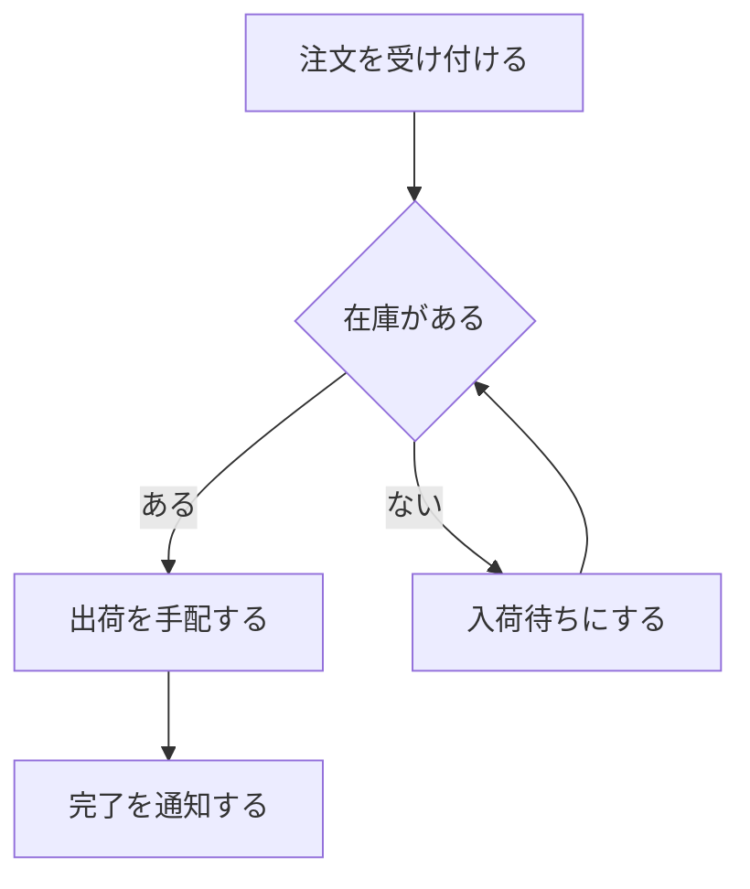
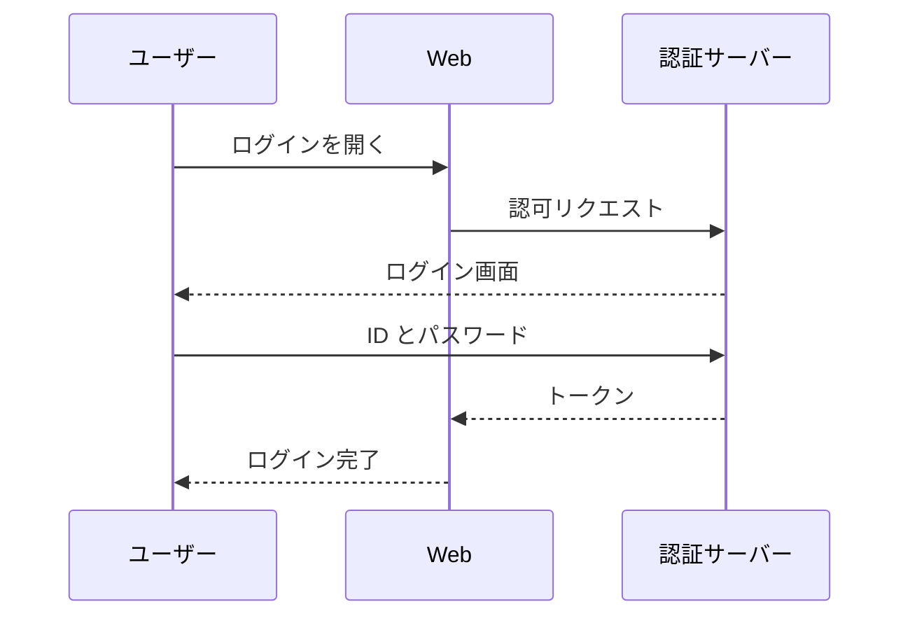
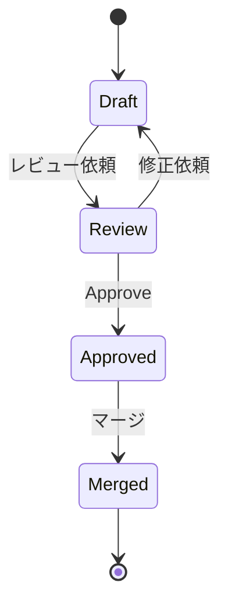

# md-view デモ

`/md plugins/md-view/docs/demo.md` で pane に開くと、下の 3 つの図が描画される。

## 注文の流れ (フローチャート)

```mermaid
graph TD
  A[注文を受け付ける] --> B{在庫がある}
  B -->|ある| C[出荷を手配する]
  B -->|ない| D[入荷待ちにする]
  D --> B
  C --> E[完了を通知する]
```

## ログインの流れ (シーケンス図)

```mermaid
sequenceDiagram
  participant U as ユーザー
  participant W as Web
  participant A as 認証サーバー
  U->>W: ログインを開く
  W->>A: 認可リクエスト
  A-->>U: ログイン画面
  U->>A: ID とパスワード
  A-->>W: トークン
  W-->>U: ログイン完了
```

## PR の状態 (状態遷移図)

```mermaid
stateDiagram-v2
  [*] --> Draft
  Draft --> Review: レビュー依頼
  Review --> Draft: 修正依頼
  Review --> Approved: Approve
  Approved --> Merged: マージ
  Merged --> [*]
```
